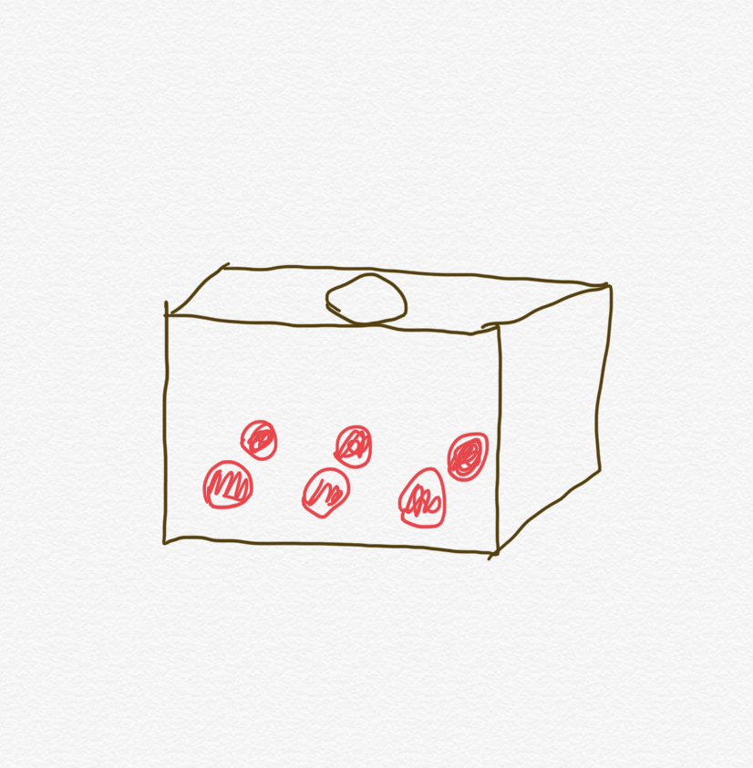
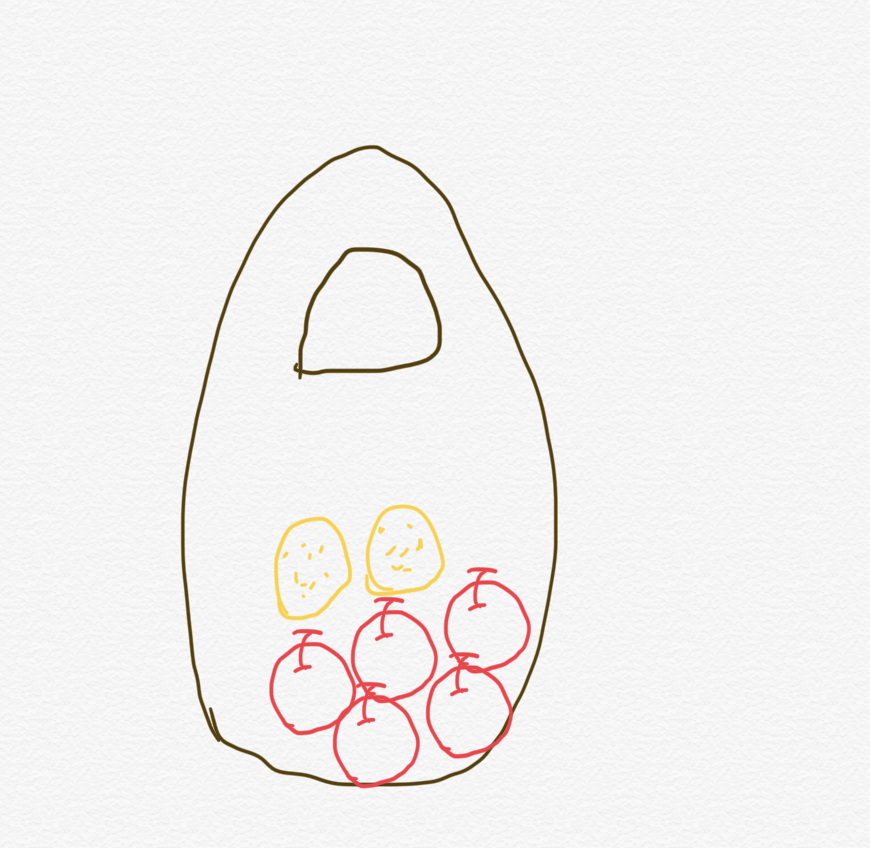

> 这是一个教材章节的示例
# 可能性
## 引言
* 生活中，我们经常会听到人们说一些事是“不可能的”，比如：“太阳从西边升起”。也有一些事，在我们看来可能性很低，比如：“彩票中大奖”。也有的事，可能性很高，比如：“很久不吃饭之后，我们会饿”。那么，究竟什么是可能性呢？可能性的大小又意味着什么呢？
## 可能性
### 想象一下，现在我们有一个盒子，盒子里装着6个红色的球。现在我们从里面随便摸一个球：

* 一定会摸出红色的球吗？答案很明显，一定会摸出红色的球，因为盒子里只有红色的球。这时候，我们把摸出红色的球的可能性叫做：“一定会发生”。
* 那么，我们能摸出蓝色的球吗？盒子里并没有蓝色的球，所以一定不会摸出来蓝色的球。这时候我们把“摸出蓝色球”的可能性叫做：“一定不会发生”。
* 如果我们在刚才的盒子里，放入一个绿色的球，那么，我们一定会摸出刚才放入的绿色的球吗？答案是，可能会，也可能不会，因为现在盒子里既有红色的球，又有绿色的球，所以，我们把“摸出绿色的球的可能性叫做”：“可能会发生”。
### 到目前为止，我们已经学习了3种可能性：“一定会发生”、“一定不会发生”，和“可能会发生”。
## 可能性的大小
* 刚才我们通过一个盒子里的小球的例子探索了什么是“可能性”，那什么是可能性的大小呢？简单来说，可能性大的事情比较容易发生，可能性小的事情不容易发生，比如：现在，一个袋子里有5个苹果和2个橙子，如果小明蒙上眼睛，随便从这个袋子里抓一个水果，抓出苹果的可能性比较大，还是抓出橙子的可能性比较大呢？

* 袋子里的苹果比橙子多，所以我们随便摸一个水果的话，摸出苹果的可能性是比较大的。
* 那么对于一件不是特别明显的事情，我们该如何确定它的可能性呢？比如，如果我们抛出一枚图钉，是头着地的可能性比较大，还是尾着地的可能性比较大呢？为了解决这个问题，有人做了一个实验。它把这个钉子抛出去了100次，每次都记录它的头着地还是尾着地，最后，他发现这枚钉子尾着地的可能性比较高。
### 看完了之前的讲解，相信你对可能性这个概念有了初步的见解。下面我们来做练习吧。
## 练习
> NOT IMLPLIMENTED YET
